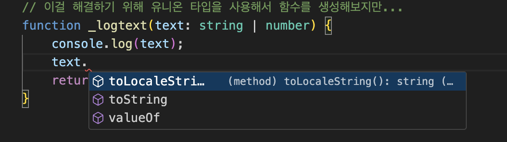
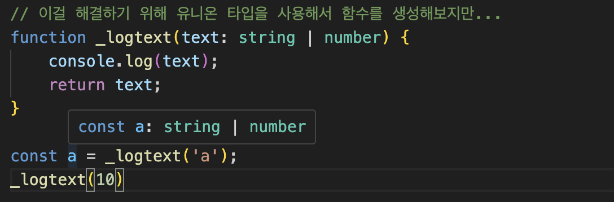
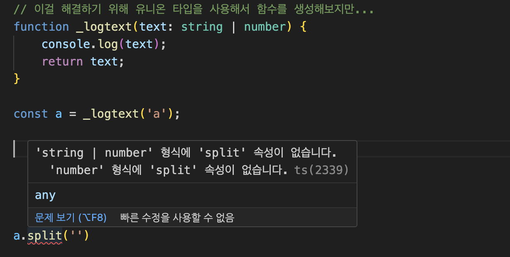

# 타입스크립트에서의 제네릭 🌟

타입스크립트의 제네릭은 코드의 유연성을 높이고 재사용성을 개선하기 위해 사용되는 강력한 기능입니다.  
다양한 타입에 대해 동작할 수 있는 컴포넌트를 생성할 수 있게 해줍니다.

## 제네릭의 기본 개념 📚

제네릭을 사용하면 함수, 클래스, 인터페이스 등을 다양한 타입으로 재사용할 수 있습니다.  
이를 통해 타입 검사를 유연하게 할 수 있으며, 코드 중복을 줄일 수 있습니다.

## 제네릭 사용 이유 🤔

- 타입 안전성 보장: 제네릭을 사용하면 컴파일 시간에 타입을 체크하여 런타임 오류를 줄일 수 있습니다.  
- 코드 재사용성 향상: 다양한 타입에서 동일한 로직을 사용할 수 있어 코드를 재사용하기 쉽습니다.   

## 제네릭 사용 전에, 유니온 타입으로 사용했을 때의 문제점
  
### input 에 대한 문제점들은 해결이 되는데, output에 대한 문제점들이 생김.

1. 기존에 유니온 타입으로 기존 타입지정 문법을 보완하려 했지만...  
  
<br>
보다시피 .을 찍었을 때,  
타입스크립트에서 number와 string이 공통으로 접근할 수 있는 속성과 api에 대해서만 프리뷰를 제공해준다.  
타입이 number 가 될지, string이 될지 모르는데도 말이다.  
  
2. 유니온 타입에서의 타입추론 오류  

  
분명 문자열을 대입해줬는데, 왜 string 이나 number 라고 추론을 할까...?

3. 1번과 관련 있는 내용인데, 결국엔 타입이 정확하게 추론이 되지 않는 이상, api나 속성을 제공하지 않는거 같다.



## 기본 예시 💡

```typescript
function identity<T>(arg: T): T {
    return arg;
}
```

이 함수는 입력된 `arg`와 동일한 타입 `T`를 반환합니다.  
이 때 `T`는 함수가 호출될 때 결정됩니다.  

## 제네릭의 고급 사용법 예시 🚀

제네릭에는 제약 조건을 추가하여 사용할 수 있는 타입을 제한할 수 있습니다.  

```typescript
interface Lengthwise {
    length: number;
}

function loggingIdentity<T extends Lengthwise>(arg: T): T {
    console.log(arg.length);  // 이제 `.length` 프로퍼티가 있음을 알 수 있습니다.
    return arg;
}
```
<br>

## 타입 지정 문법과의 차이점 📈

타입스크립트의 기본 타입 지정 방법은 변수, 함수의 매개변수, 반환 값 등에 구체적인 타입을 지정하는 것입니다.  
반면, 제네릭을 사용하면 특정 타입에 종속되지 않는 유연한 코드를 작성할 수 있습니다.  

### 기본 타입 지정 예시:

```typescript
function returnNumber(arg: number): number {
    return arg;
}

function returnString(arg: string): string {
    return arg;
}
```

### 제네릭 사용 예시:

```typescript
function returnWhateverTypeYouWant<T>(arg: T): T {
    return arg;
}
```

### 제네릭을 사용하면 유연하게 타입에 대해 대처할 수 있습니다. (호출할 때!)  
  
```typescript
function __logText<T>(text : T) : T {
    console.log(text);
    return text;
}

const str = __logText<string>('키득키득');
str.split('');

const login = __logText<boolean>(true);
```  
  
## 결론 🎉

타입스크립트의 제네릭을 사용하면 타입 안전성을 유지하면서 코드의 재사용성과 유연성을 대폭 향상시킬 수 있습니다.  
제네릭은 타입스크립트를 사용하는 모든 개발자가 익혀야 할 중요한 기능 중 하나입니다.

