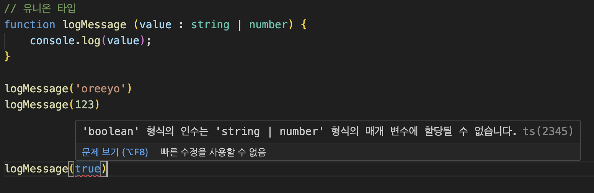
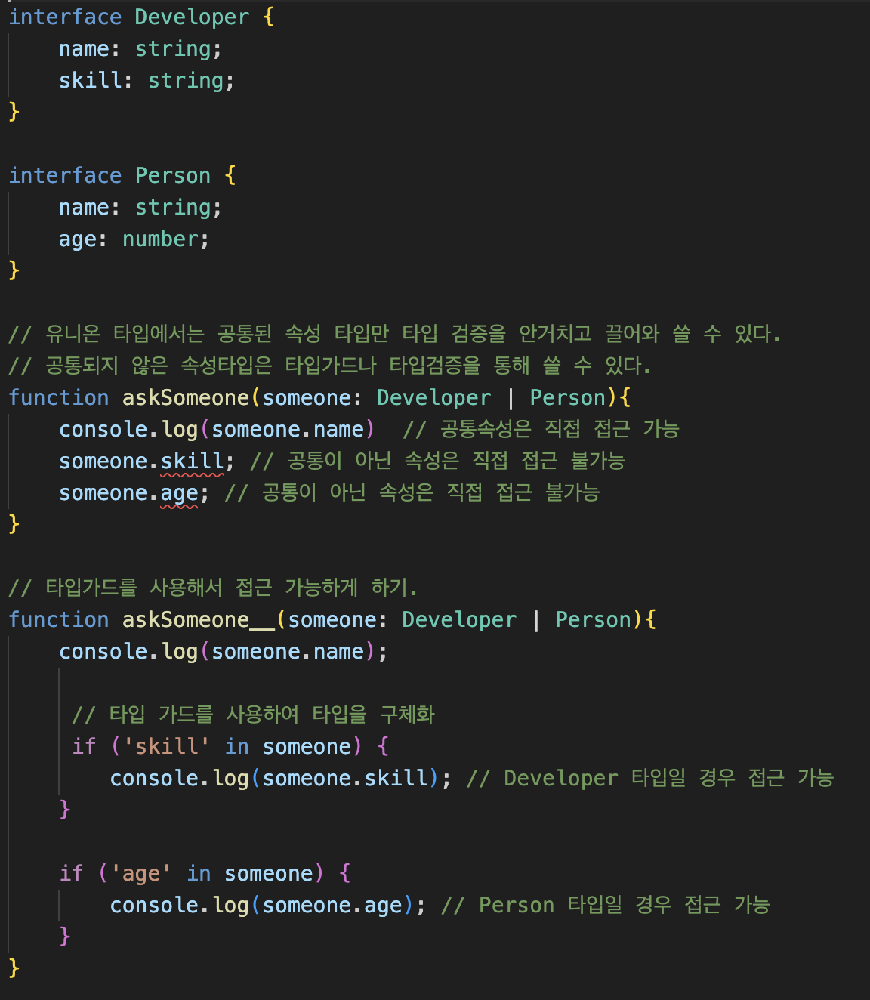

# TypeScript Optional Parameters

TypeScript에서 Optional Parameter는 함수를 정의할 때, 
해당 파라미터가 필수가 아니라 선택적으로 제공될 수 있음을 나타냅니다. 
즉, 이 파라미터에 값을 전달하지 않아도 함수가 정상적으로 호출될 수 있으며, 
파라미터가 제공되지 않았을 때를 대비해 해당 파라미터는 `undefined`가 될 수 있습니다.

## 정의 방법

Optional Parameter는 파라미터 이름 뒤에 `?` 기호를 추가하여 표시합니다. 
이렇게 함으로써, 해당 파라미터는 선택적으로 처리됩니다.

## 예제

예를 들어, 어떤 사용자의 이름을 인사말과 함께 출력하는 함수가 있고, 
사용자의 이름이 선택적으로 제공될 수 있다면, 다음과 같이 함수를 정의할 수 있습니다

```typescript
function greet(name?: string) {
  if (name) {
    console.log(\`Hello, ${name}!\`);
  } else {
    console.log("Hello!");
  }
}

greet();           // 출력: "Hello!"
greet("Alice");    // 출력: "Hello, Alice!"
```

위 예제에서 `greet` 함수의 `name` 파라미터는 Optional Parameter로 정의되었습니다. 
따라서 `name` 파라미터에 값을 제공하지 않고 `greet` 함수를 호출해도 TypeScript 컴파일러는 에러를 발생시키지 않습니다. 
이런 방식으로 Optional Parameters는 함수에 더 많은 유연성을 제공하며, 다양한 시나리오에서 함수를 재사용할 수 있게 합니다.

<br>

# TypeScript의 Interface 🚀

## 📘 개요

TypeScript의 `interface`는 코드 내에서 사용자 정의 타입을 정의할 수 있게 해주는 강력한 기능입니다.
`interface`를 사용하면 객체의 구조를 명확하게 지정할 수 있으며, 
코드의 가독성과 유지 보수성을 높일 수 있습니다.

## 📌 기본 사용법

`interface`를 사용하여 객체의 구조를 정의할 수 있습니다. 
예를 들어, 사용자 객체를 정의하는 인터페이스는 다음과 같이 작성할 수 있습니다

```typescript
interface User {
  id: number;
  name: string;
  age?: number; // 선택적 속성
}
```

## 🛠️ 확장성

`interface`는 확장 가능하여, 한 인터페이스가 다른 인터페이스를 상속받을 수 있습니다. 
이를 통해 코드의 재사용성을 높일 수 있습니다

```typescript
interface Person {
  name: string;
  age: number;
}

interface Employee extends Person {
  employeeId: number;
}
```
<br>

밑의 이미지를 보면, 
상속받은 인터페이스의 요소들을 다 사용해야만 한다.
일부만 사용해서는 인터페이스에 어긋난다.


<br>
<br>

## 🔍 선택적 속성과 읽기 전용 속성

- **선택적 속성**: 객체가 특정 속성을 가질 수도 있고, 가지지 않을 수도 있음을 나타냅니다. `?` 기호를 사용합니다.
- **읽기 전용 속성**: 객체 생성 후에는 변경할 수 없는 속성을 정의할 때 사용합니다. `readonly` 키워드를 사용합니다.

```typescript
interface Car {
  readonly make: string;
  model: string;
  year?: number;
}
```

## 💡 함수 타입

`interface`를 사용하여 함수의 타입을 정의할 수도 있습니다. 
이는 함수의 시그니처를 명시적으로 선언하는 데 유용합니다:

```typescript
interface SearchFunc {
  (source: string, subString: string): boolean;
}
```

## 🎯 정리

`interface`는 TypeScript에서 타입 체크를 위한 강력한 도구입니다. 
객체의 구조를 명확하게 정의하고, 코드의 안정성을 높이며, 개발 과정에서의 오류를 줄일 수 있습니다.

<br>

## TypeScript에서 Interface의 Indexing 📚

TypeScript는 강력한 타입 시스템을 가진 JavaScript의 상위 집합입니다. 
TypeScript의 핵심 기능 중 하나는 개발자가 명시적으로 타입을 정의할 수 있게 하는 `interface`입니다.
`interface`를 사용하면 객체의 구조를 정의할 수 있으며, 
이를 통해 더 안정적이고 유지보수하기 쉬운 코드를 작성할 수 있습니다. 

특히, `interface`의 indexing 기능은 객체의 속성 이름과 타입을 동적으로 정의할 수 있게 해줍니다.

## 1. 타입스크립트에서 Interface의 Indexing의 개념 🧐

Interface의 Indexing은 `index signature`를 사용하여 객체의 모든 속성이 특정 타입을 가지도록 강제합니다. 
이는 미리 정의된 속성 이름이 아닌, 동적 속성 이름에 대해 타입을 지정할 수 있게 해줍니다.

## 2. 타입스크립트에서 Interface의 Indexing의 예시 📝

```typescript
interface StringDictionary {
  [key: string]: string;
}

let myDict: StringDictionary = {
  name: "John Doe",
  email: "john@example.com"
};
```

이 예시에서 `StringDictionary` 인터페이스는 문자열 키에 대해 문자열 값을 가지는 객체를 정의합니다. 
이를 통해 다양한 속성을 동적으로 추가할 수 있습니다.

두번째 예시에서는 string 값을 대입해야하는데, number 값을 대입해보겠습니다.


보다시피 타입 에러 알림이 뜹니다.


<br>

## 3. 타입스크립트에서 Interface의 Indexing의 활용 🔍

Interface의 Indexing은 API 응답, 설정 객체 등 다양한 곳에서 유용하게 활용됩니다. 
예를 들어, 서로 다른 키와 값을 가진 객체를 유연하게 처리할 수 있습니다. 
이 기능을 사용함으로써 TypeScript 코드의 유연성과 재사용성이 향상됩니다.


Interface의 Indexing을 활용하는 구체적인 예시를 보여드리겠습니다. 
이 예시에서는 API 응답을 처리하는 상황을 가정해보겠습니다. 
API에서 반환된 데이터는 다양한 키와 값을 가질 수 있으며, 이를 유연하게 처리하고자 합니다.
<br>

## TypeScript Interface Indexing 활용 예시: API 응답 처리 📝

API로부터 받은 응답 데이터의 구조가 다양할 때, 
우리는 Interface의 Indexing을 사용하여 이를 효과적으로 처리할 수 있습니다.

```typescript
interface ApiResponse {
  [key: string]: string | number | boolean | object;
}

function handleApiResponse(response: ApiResponse) {
  // response 객체의 각 키와 값을 처리
  for (const key in response) {
    const value = response[key];
    console.log(`${key}: ${value}`);
    // 여기서 각 값의 타입에 따라 필요한 처리를 수행할 수 있습니다.
  }
}

// 예를 들어, 다음과 같은 API 응답을 받았다고 가정합니다.
const apiResponse: ApiResponse = {
  userId: 1,
  userName: "JohnDoe",
  verified: true,
  address: {
    street: "123 Main St",
    city: "Anytown",
  },
};

// 응답 처리 함수 호출
handleApiResponse(apiResponse);
```
<br>
이 예시에서는 ApiResponse 인터페이스를 사용해 API 응답 객체의 구조를 유연하게 정의했습니다.
인터페이스의 Index Signature [key: string]: string | number | boolean | object; 는 
응답 객체가 문자열 키를 가지며, 
그 값이 문자열, 숫자, 불리언, 객체 중 하나가 될 수 있음을 나타냅니다.
<br>
handleApiResponse 함수는 이러한 응답 객체를 받아, 각 키와 값을 순회하며 필요한 작업을 수행합니다. 
이 방법을 통해, 우리는 서로 다른 형태의 API 응답 데이터를 효과적으로 처리할 수 있습니다.
Interface의 Indexing을 활용함으로써, 
TypeScript 코드의 유연성과 재사용성을 크게 향상시킬 수 있습니다.

<br>
<br>

# TypeScript Interface의 Dictionary Pattern 📖

TypeScript에서 Interface를 사용하는 다양한 방법 중 하나는 Dictionary Pattern입니다. 
이 패턴은 객체의 속성을 유연하게 정의할 수 있게 해주며,
특정 형태의 키와 값을 갖는 객체를 정의하는 데 유용합니다.

## Dictionary Pattern의 개념 🧠

Dictionary Pattern은 객체가 미리 알 수 없는 여러 키를 가지고 있을 때 유용합니다.
각 키는 같은 타입의 값을 가지며, 
이러한 특성은 동적 속성을 가진 객체를 타입 안전하게 처리하는 데 도움을 줍니다.

## Dictionary Pattern 예시 🌟

```typescript
interface UserDictionary {
  [key: string]: string;
}

const users: UserDictionary = {
  'john.doe': 'John Doe',
  'jane.doe': 'Jane Doe'
};

// 사용자 이름에 접근하기
console.log(users['john.doe']); // John Doe
```

이 예시에서 `UserDictionary` 인터페이스는 문자열 키와 문자열 값을 가지는 객체를 정의합니다.
이를 통해 사용자 ID를 키로 하고 
사용자 이름을 값으로 하는 사용자 사전을 생성할 수 있습니다.

<br>
두번째 예시를 보면,


해당 이미지에서 obj_ 의 값들은 전부 RegExp 타입인데,
string을 대입해주려하니 에러가 출력되는게 보입니다.
이와같이 딕셔너리 패턴은 특정한 형태의 키와 값의 타입을 지정하는데 유용합니다.  


# '타입별칭(Type Aliases)'과 '인터페이스(Interfaces)'의 차이점 🤔

TypeScript는 개발자에게 데이터의 형태를 명시적으로 선언할 수 있는 두 가지 주요 도구를 제공합니다  
'타입별칭(Type Aliases)'과 '인터페이스(Interfaces)'.  
이 두 도구는 유사해 보일 수 있지만, 몇 가지 중요한 차이점이 있습니다.  

## 타입별칭(Type Aliases) 📝

타입별칭은 새로운 타입 이름을 정의하는 방법입니다.   
기본적으로, 기존 타입에 대한 새로운 이름을 부여하여 사용합니다.   
타입별칭은 객체, 유니온, 인터섹션, 튜플 등 다양한 타입의 구조를 정의할 수 있습니다.  

### 타입별칭 예시:

```typescript
type User = {
  name: string;
  age: number;
};

type ID = string | number;
```

여기서 `User`와 `ID`는 타입별칭입니다.  
`User`는 객체의 구조를, `ID`는 문자열 또는 숫자라는 유니온 타입을 정의합니다.  

## 인터페이스(Interfaces) 🖊️

인터페이스는 객체의 구조를 정의하는 또 다른 방법입니다.  
주로 객체의 형태를 정의하는 데 사용되며, 클래스에 의해 구현될 수 있습니다.  
인터페이스는 확장성이 뛰어나며, 다른 인터페이스를 확장하거나, 클래스가 인터페이스를 구현할 수 있습니다.  

### 인터페이스 예시:

```typescript
interface User {
  name: string;
  age: number;
}

interface Employee extends User {
  employeeId: number;
}
```

여기서 `User`는 기본 사용자 정보를 정의하는 인터페이스이며,  
`Employee`는 `User`를 확장하여 직원 ID를 추가한 인터페이스입니다.  

## 주요 차이점 ✨

- **확장성**: 인터페이스는 확장할 수 있으나, 타입별칭은 확장할 수 없습니다. 타입별칭은 유니온이나 튜플과 같은 다양한 타입의 별칭을 만들 수 있지만, 인터페이스처럼 확장하여 사용할 수는 없습니다.
- **재선언**: 인터페이스는 같은 이름으로 여러 번 선언할 수 있으며, TypeScript는 이를 하나의 인터페이스로 자동 합칩니다. 반면, 타입별칭은 재선언할 수 없습니다.  

각각의 사용 사례와 요구 사항에 따라 적절한 도구를 선택하여 사용하는 것이 중요합니다.  


## type vs interface
타입 별칭과 인터페이스의 가장 큰 차이점은 타입의 확장 가능 / 불가능 여부입니다.  
인터페이스는 확장이 가능한데 반해 타입 별칭은 확장이 불가능합니다.  
따라서, 가능한한 type 보다는 interface로 선언해서 사용하는 것을 추천합니다.

## TIP
좋은 소프트웨어는 언제나 확장이 용이해야 한다는 원칙에 따라 가급적 확장 가능한 인터페이스로 선언하면 좋습니다 😃  


## 타입별칭을 사용했을 때와 인터페이스를 사용했을 때 tooptip 차이


<br>
<br>


# TypeScript에서 'any' 타입 사용을 지양해야 하는 이유 🚫🔍

TypeScript는 JavaScript에 타입 시스템을 추가하여,  
개발 과정에서 타입 관련 오류를 사전에 발견하고,  
코드의 가독성과 유지보수성을 향상시키는 것을 목표로 합니다.  
'any' 타입은 모든 종류의 값을 허용하는 타입으로, TypeScript의 이러한 장점을 무력화시킬 수 있습니다.

## 'any' 타입의 문제점 🤔

### 예시: 타입 체크 무시

```typescript
function add(a: any, b: any): any {
  return a + b;
}

console.log(add(1, 2)); // 3
console.log(add("1", 2)); // '12'
console.log(add({ a: 1 }, { b: 2 })); // '[object Object][object Object]'
```

이 예시에서 `add` 함수는 모든 타입의 인자를 받을 수 있도록 `any`로 정의되었습니다.  
이는 함수의 의도와는 다르게, 문자열, 숫자, 심지어 객체까지 더하는 잘못된 사용을 허용합니다.  
결과적으로, 이는 예상치 못한 결과나 런타임 오류로 이어질 수 있습니다.

### 타입 안전성 상실

`any` 타입을 사용하면 TypeScript 컴파일러가 타입 체크를 수행하지 못하게 됩니다.  
이로 인해 개발자가 코드 내의 실수를 놓치게 되며, 이는 버그로 이어질 수 있습니다.

## 'any' 대신 'unknown' 사용하기 ✅

TypeScript 3.0에서는 `any` 타입의 대안으로 `unknown` 타입이 도입되었습니다.  
`unknown` 타입은 모든 값을 받을 수 있지만, 해당 값에 대해 무언가를 하기 전에 타입을 좁혀나가야 한다는 점에서 `any`와 다릅니다.

```typescript
function safeAdd(a: unknown, b: unknown): number {
  if (typeof a === "number" && typeof b === "number") {
    return a + b;
  }
  throw new Error("Invalid input");
}
```

이 함수는 `a`와 `b`가 모두 숫자일 때만 더하기를 수행하며, 그렇지 않을 경우 오류를 발생시킵니다.  
이렇게 `unknown`을 사용함으로써 타입 안전성을 유지하면서도 다양한 타입을 유연하게 처리할 수 있습니다.

## 결론 📌

`any` 타입은 TypeScript의 타입 시스템을 우회하는 빠른 해결책처럼 보일 수 있지만,  
장기적으로는 코드의 안정성과 가독성을 해칩니다.  
가능한 한 `any`의 사용을 피하고, `unknown`과 같은 안전한 타입을 사용하여 타입 안전성을 보장해야 합니다.

<br>

# TypeScript의 유니온 타입과 인터섹션 타입 🤝

TypeScript는 개발자들에게 유연하지만 강력한 타입 시스템을 제공하여, 다양한 상황에서 타입의 조합을 가능하게 합니다.  
이러한 타입의 조합 중에서 유니온 타입(Union Types)과 인터섹션 타입(Intersection Types)은 특히 유용합니다.  

## 1. 유니온 타입 (Union Types) 🔀

유니온 타입은 여러 타입 중 하나가 될 수 있는 값을 의미합니다.  
이는 '또는'의 관계로 이해할 수 있으며,  
변수나 함수가 받을 수 있는 타입을 여러 개 지정할 때 사용됩니다.  

### 예시:

```typescript
function printId(id: number | string) {
  console.log("Your ID is: " + id);
}

printId(101); // 숫자 가능
printId("202"); // 문자열도 가능
```
<br>

<br>


<br>

## 2. 인터섹션 타입 (Intersection Types) ✖️

인터섹션 타입은 여러 타입을 모두 만족하는 타입을 의미합니다.  
이는 '그리고'의 관계로 이해할 수 있으며,  
여러 타입의 특성을 모두 갖춘 하나의 타입을 정의할 때 사용됩니다.  

### 예시:

```typescript
interface Name {
  name: string;
}

interface Age {
  age: number;
}

type Person = Name & Age;

let johnDoe: Person = { name: "John Doe", age: 32 }; // Name과 Age 인터페이스 모두 충족
```

## 3. 유니온 타입과 인터섹션 타입의 차이점 🔄

유니온 타입과 인터섹션 타입은 타입의 조합을 다루는 방식에서 근본적인 차이를 가집니다.  
유니온 타입은 변수나 함수가 '이 타입 또는 저 타입' 중 하나를 가질 수 있음을 의미합니다.  
반면, 인터섹션 타입은 여러 타입의 특성을 '모두' 갖춘 하나의 타입을 정의합니다.  

### 차이점 예시:

```typescript
// 유니온 타입 예시
function printId(id: number | string) {
  console.log("Your ID is: " + id);
}

// 인터섹션 타입 예시
type Person = Name & Age;
let employee: Person = { name: "John Doe", age: 32, employeeId: 1234 };
```

이 예시에서 볼 수 있듯이,  
유니온 타입은 더 넓은 범위의 타입을 허용하는 반면,  
인터섹션 타입은 더 구체적이고 제한된 타입을 생성합니다.
